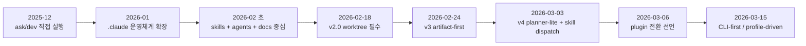
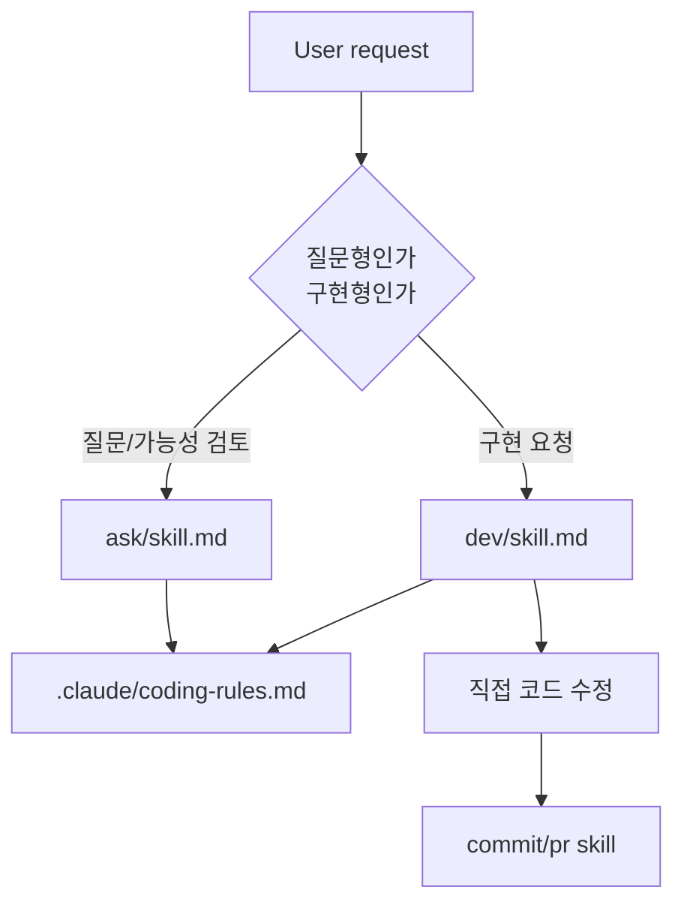
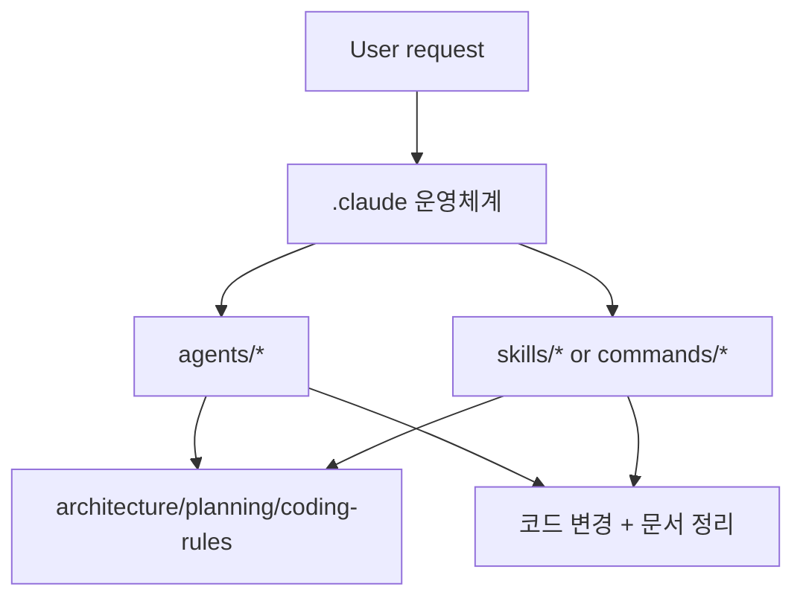
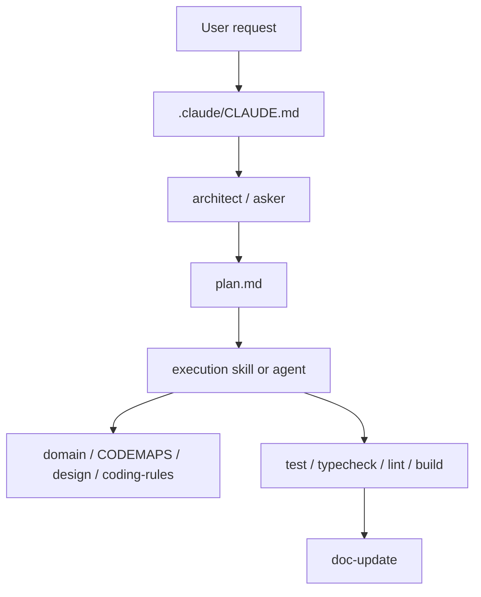
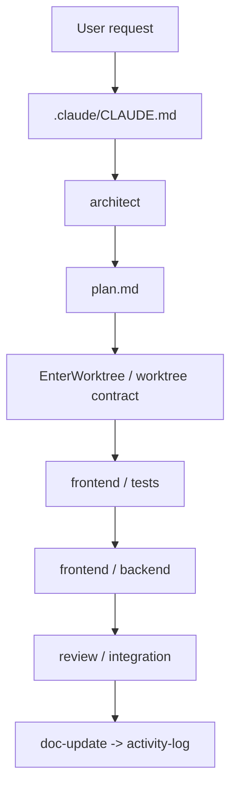
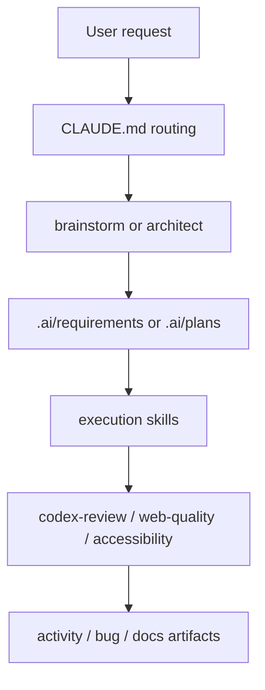
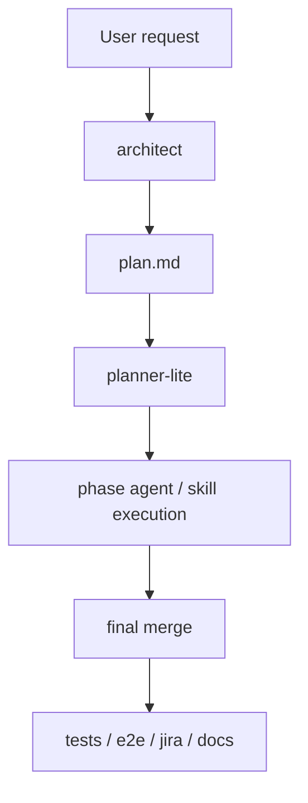
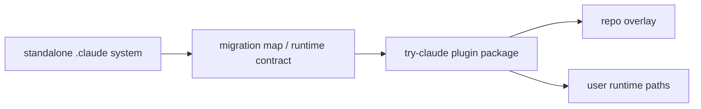
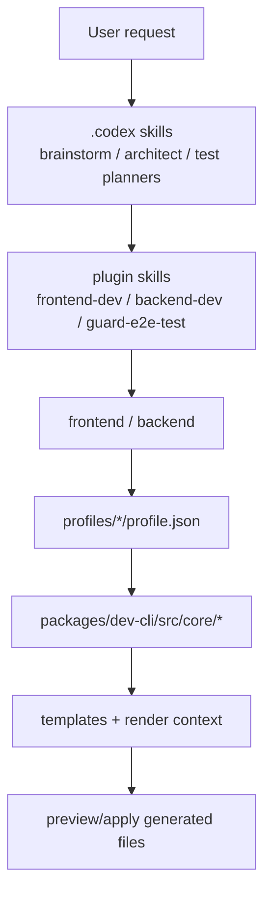
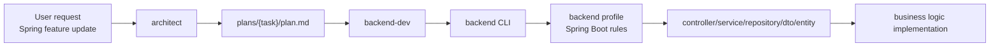

# Claude Code Workflow Evolution Map

## 목적

이 문서는 아래 두 저장소를 하나의 연속된 진화 과정으로 보고 정리한다.

- `claude-code-skills`
- `try-claude-code`

정리 목표는 다음 4가지다.

1. 시기별로 사용자가 요청했을 때 어떤 진입 문서가 라우팅을 담당했는지 설명한다.
2. 각 버전대에서 실제로 어떤 문서와 스킬과 에이전트와 코드가 연결됐는지 도식화한다.
3. 규칙이 어디에 있었는지, 그리고 그 규칙이 설명 문서였는지 실행 강제 규칙이었는지 구분한다.
4. 현재 구조가 왜 `plugin + planning skill + dev CLI + profiles` 조합으로 바뀌었는지 보여준다.

## 범위와 해석 기준

- **역사 레포:** `claude-code-skills`
- **분리 후 제품화 레포:** `try-claude-code`
- **핵심 전환일:** `2026-03-06`

### 주의할 점

`claude-code-skills` 로컬 상태는 `2026-03-06` 플러그인 전환 작업 브랜치의 흔적이 남아 있다.

- `.claude/CHANGELOG.md`에는 `5.0.0` 전환 내용이 기록되어 있다.
- `.claude/VERSION`은 `4.5.2` 상태다.

즉, `claude-code-skills`는 "기존 단일 레포의 마지막 상태"와 "try-claude 분리 전환 준비 상태"가 겹쳐 있다. 이 문서는 그 겹침을 분리해서 읽는다.

## 한눈에 보는 전체 진화



## 버전대별 핵심 요약

| 구간 | 날짜/버전 | 요청 진입점 | 핵심 참조 문서 | 실행 단위 | 규칙의 성격 | 대표 산출물 |
|---|---|---|---|---|---|---|
| Stage 0 | 2025-12-29 ~ 2026-01-10 | `ask`, `dev`, `commit`, `pr` | `ask/skill.md`, `dev/skill.md`, `.claude/coding-rules.md` | 스킬 단독 실행 | 설명형 규칙 | 직접 코드 수정 |
| Stage 1 | 2026-01-11 ~ 2026-02-10 | `.claude` 시스템 + 에이전트 | `.claude/architecture.md`, `.claude/planning.md`, 에이전트 문서 | 에이전트 + 문서 기반 협업 | 설명형 규칙 + 구조 정리 | 구조화된 `.claude` 운영 |
| Stage 2 | 2026-02-11 ~ 2026-02-17 | skills/agents 기반 실행 | `.claude/CLAUDE.md`, `.claude/skills/*`, `.codex/skills/*` | 스킬 + 에이전트 | 문서 중심 운영 계약 | plan / docs / reviews |
| Stage 3 | 2026-02-18 ~ 2026-02-23 | architect 주도 + worktree | `.claude/CLAUDE.md`, architect, worktree 정책 | worktree 격리된 phase 실행 | 강한 운영 계약 | phase별 실행, review, log |
| Stage 4 | 2026-02-24 ~ 2026-03-02 | artifact-first Claude/Codex 흐름 | `.claude/CLAUDE.md`, `.ai/*`, `.codex/skills/*` | artifact 기반 실행 | 문서 계약 강화 | `.ai/plans`, `.ai/requirements`, `.ai/logs` |
| Stage 5 | 2026-03-03 ~ 2026-03-05 | skill dispatch + planner-lite | `planner-lite`, `architect`, `init-agent`, `jira` | 계획 스킬 + 실행 스킬 | 문서 계약 + 부분 자동화 | `plan.md`, 테스트 아티팩트, Jira 산출물 |
| Stage 6 | 2026-03-06 | pluginization 전환 | `try-claude-plugin` 관련 계약 문서 | 플러그인 패키징 | 배포/마이그레이션 계약 | plugin seed/bootstrap/migration |
| Stage 7 | 2026-03-06 ~ 현재 | plugin + CLI-first | `marketplace.json`, `plugin/skills/*`, `profiles/*`, `packages/dev-cli/*`, `.codex/skills/*` | 계획 스킬 + 플러그인 스킬 + CLI | 실행 강제 규칙 | preview/apply 생성, tests/evals |

---

## Stage 0. 2025-12-29 ~ 2026-01-10
## ask/dev 직접 실행 시기

### 당시 요청 처리 흐름

사용자가 기능을 요청하면 먼저 요청 성격에 따라 `ask` 또는 `dev`가 실행되었다.

- "이거 가능해?" → `ask`
- "만들어줘" → `dev`
- "커밋해줘" → `commit`
- "PR 올려줘" → `pr`

### 실제로 따라간 문서

- `ask/skill.md`
- `dev/skill.md`
- `.claude/coding-rules.md`
- `.claude/folder-structure.md`

### 동작 도식



### 규칙과 연결 방식

- 라우팅 규칙은 파일 frontmatter의 `description`과 trigger 문구에 사실상 의존했다.
- 구현 규칙은 `.md` 문서에 서술형으로 적혀 있었다.
- 테스트는 자동 강제가 아니라 사용자 확인과 스킬 절차에 따라 선택적으로 수행됐다.
- 폴더 구조 규칙과 네이밍 규칙은 "읽고 따르는 문서"였지, 엔진이 강제하는 구조는 아니었다.

### 이 시기의 특징

- 사람에게 설명하는 스킬이 중심이었다.
- 문서가 많아질수록 Claude가 읽어야 할 양도 같이 늘어났다.
- 규칙 위반을 막는 기계적 가드가 약했다.
- 산출물은 주로 "바로 코드 변경"이었다. 계획 아티팩트가 핵심은 아니었다.

---

## Stage 1. 2026-01-11 ~ 2026-02-10
## `.claude` 운영체계 확장 시기

### 핵심 변화

이 시기부터 단순 스킬 모음이 아니라 `.claude/` 자체를 운영체계처럼 다루기 시작했다.

주요 파일:

- `.claude/architecture.md`
- `.claude/planning.md`
- `.claude/agents/*`
- `.claude/commands/*`

### 당시 요청 처리 흐름



### 규칙과 연결 방식

- 규칙은 여전히 문서 중심이었다.
- 다만 이제 규칙 문서가 분산되기 시작했다.
  - 아키텍처 규칙
  - 계획 규칙
  - 폴더 구조 규칙
  - 에이전트 역할 규칙

### 이 시기의 의미

- "무슨 작업을 하느냐"뿐 아니라 "어떤 역할이 그 작업을 해야 하느냐"가 분리되기 시작했다.
- 이후 skills/agents 구조로 넘어갈 토대가 여기서 생겼다.

---

## Stage 2. 2026-02-11 ~ 2026-02-17
## skills + agents + docs 중심 시기

### 핵심 변화

이 시기에는 `skills-based architecture`가 본격 도입된다.

대표 문서:

- `.claude/CLAUDE.md`
- `.claude/skills/frontend-dev/SKILL.md`
- `.claude/skills/backend-dev/SKILL.md`
- `.claude/skills/ui-publish/SKILL.md`
- `.codex/skills/architect/SKILL.md`

### 요청이 들어왔을 때의 전체 플로우



### 이 시기 `frontend-dev`가 실제로 따른 문서

당시 `frontend-dev`는 대략 아래 순서로 움직였다.

1. `plan.md` 읽기
2. `domain.md` 읽기
3. `CODEMAPS/frontend.md` 읽기
4. `design/` 읽기
5. 필요 시 docs 검색
6. feature branch 생성
7. 구현
8. `pnpm test`
9. `typecheck`
10. `lint --fix`
11. `build`

즉 이때는 계획은 생겼지만, 실제 코드 생성은 아직 문서와 사람이 기억하는 규칙에 크게 의존했다.

### 규칙과 연결 방식

- 라우팅 규칙: `.claude/CLAUDE.md`
- 실행 규칙: 각 `SKILL.md`
- 도메인/구조 규칙: `.ai/references/*`, `.ai/codemaps/*`, `.ai/references/design/*`
- 검증 규칙: 테스트, 타입체크, 린트, 빌드

### 이 시기의 한계

- 문서 참조량이 많아 토큰 비용이 커졌다.
- 규칙이 서술형이라 같은 요청에도 생성 패턴이 흔들릴 수 있었다.
- plan과 docs는 좋아졌지만 scaffold 강제력이 약했다.
- 스킬이 전문화되기 시작했지만, 각 스킬이 독립적으로 닫힌 시스템은 아니었다.
  - 예: `frontend-dev`는 당시 `coding-rules`, `design`, `CODEMAPS`, `domain`, `plan`을 모두 읽는 구조였다.
  - 즉 스킬이 실행되기 전에 읽어야 하는 공통 문서 묶음이 컸다.

---

## Stage 3. 2026-02-18 ~ 2026-02-23
## v2.x worktree 필수 + 8-phase 운영 시기

### 핵심 변화

`v2.0.0` 전후로 worktree가 사실상 필수 계약이 된다.

대표 문서:

- `.claude/CLAUDE.md`
- worktree 관련 정책 문서
- architect / planner 계열 문서

### 요청 처리 흐름



### 이 시기부터 달라진 점

- 코드 변경은 메인 브랜치 직행이 아니라 worktree 격리 공간에서 수행됐다.
- 요청 하나가 phase 단위로 분해되기 시작했다.
- "문서를 읽고 구현"에서 "계획을 세우고 phase를 밟는 운영"으로 중심축이 이동했다.

### 규칙과 연결 방식

- 작업 순서 규칙: `CLAUDE.md`
- 격리 규칙: worktree 정책
- 역할 분담 규칙: `agents/*`
- 산출물 순서 규칙: `doc-update`와 `activity-log` tail order

### 의미

이 시기부터 Claude Code는 개인 비서형에서 워크플로 엔진형으로 변했다.

---

## Stage 4. 2026-02-24 ~ 2026-03-02
## v3.x artifact-first Claude/Codex 통합 시기

### 핵심 변화

이때 `.ai/` 폴더가 공식 계약 경로로 정착한다.

대표 문서:

- `.claude/CLAUDE.md`
- `.codex/skills/architect/SKILL.md`
- `.codex/skills/brainstorm/SKILL.md`
- `.ai/plans/*`
- `.ai/requirements/*`

### 요청 처리 흐름



### 이 시기의 특징

- 문서가 더 많아졌지만 구조는 더 명확해졌다.
- 요청 처리의 중심이 대화가 아니라 아티팩트 파일이 됐다.
- Codex planning skill과 Claude execution skill의 역할 분리가 선명해졌다.

### 규칙과 연결 방식

- 계획 규칙: `architect`
- 요구사항 정리 규칙: `brainstorm`
- 실행 규칙: `.claude/skills/*`
- 운영 산출물 규칙: `.ai/*` 폴더 계약

### 이 시기 한계

- 문서 계약은 강해졌지만, 코드 생성 규칙은 아직 문서 설명 비중이 컸다.
- 실행 품질이 "규칙을 얼마나 잘 기억하느냐"에 영향을 받았다.

---

## Stage 5. 2026-03-03 ~ 2026-03-05
## v4.x planner-lite + skill dispatch + Jira 정리 시기

### 핵심 변화

대표 기능:

- `planner-lite`
- `init-agent`
- `jira`
- `skill` 기반 dispatch

### 요청 처리 흐름



### 여기서 생긴 중요한 정리

- plan 실행을 누가 소유하느냐가 `planner-lite`로 정리됐다.
- worktree lifecycle도 점점 문서가 아니라 실행 절차로 구조화됐다.
- `jira-md-review-registration`이 `jira`로 정리되면서 프로젝트 연동 스킬도 단순화됐다.

### 규칙과 연결 방식

- `architect`는 계획 생성
- `planner-lite`는 계획 실행 orchestration
- 각 실행 스킬은 자기 영역의 구현 수행
- `Jira`는 산출물 검증 후 외부 시스템 등록

이 구간은 기존 단일 레포 아키텍처의 거의 완성형이다.

---

## Stage 6. 2026-03-06
## pluginization 전환 시기

### 핵심 변화

이날부터 `claude-code-skills`의 운영체계를 **배포 가능한 플러그인**으로 분리하려는 전환이 시작된다.

관련 문서:

- `try-claude-plugin/` 구조 설명
- plugin identity / runtime contract / migration map 관련 계약 문서
- `init-try` / migration 엔진 관련 문서

### 전환 도식



### 이 시기의 핵심 의미

- 기존에는 레포 안에 `.claude`를 두고 운영했다.
- 이제는 배포 가능한 플러그인 루트가 생기고, 프로젝트별 overlay와 사용자 runtime 경로가 분리된다.
- 즉 "내 레포 내부 운영 체계"에서 "설치 가능한 제품"으로 성격이 바뀐다.

---

## Stage 7. 2026-03-06 ~ 현재
## `try-claude-code`의 plugin + CLI-first 시기

이 시기는 사실 두 단계로 다시 나뉜다.

- `2026-03-06 ~ 2026-03-14`: 플러그인 패키징, marketplace, eval 정비
- `2026-03-15 ~ 현재`: `dev-cli + profiles` 중심의 실행 강제 구조

### 현재 구조의 최상위 지도



### 현재 요청 처리의 실제 단계

예시: "대시보드 알림 필터 로직을 추가해줘"

1. 복잡한 요청이면 `.codex/skills/architect/SKILL.md`가 `plans/{task-name}/plan.md`를 만든다.
2. 구현 phase에서 `plugin/skills/frontend-dev/SKILL.md`가 실행된다.
3. `frontend-dev`는 먼저 `frontend --help`와 `frontend component`, `frontend hook`, `frontend apiHook` 같은 CLI를 사용한다.
4. CLI는 `packages/dev-cli` 엔진을 통해 현재 active profile을 로드한다.
5. profile은 `profiles/frontend/personal/v1/profile.json`과 `profiles/shared/personal/v1/profile.json`을 merge한다.
6. `normalizationRules`, `validatorRules`, `render.templateFile`, `output.filePattern`이 적용된다.
7. preview 기본 정책으로 결과를 계산하고, `--apply`일 때만 파일을 쓴다.
8. 그 뒤에 구현 스킬이 생성된 파일 안에 비즈니스 로직을 채운다.

### 현재 Spring feature 요청 처리 단계

예시: "상품 도메인에 Spring 기반 feature를 추가해줘"

1. 복잡한 요청이면 `.codex/skills/architect/SKILL.md`가 `plans/{task-name}/plan.md`를 만든다.
2. 구현 phase에서 `plugin/skills/backend-dev/SKILL.md`가 실행된다.
3. `backend-dev`는 직접 Java 파일을 만들지 않고 먼저 `backend --help`를 본다.
4. 이어서 `backend module`, `backend requestDto`, `backend responseDto`, `backend entity`를 통해 Spring feature 뼈대를 생성한다.
5. CLI는 `profiles/backend/personal/v1/profile.json`을 읽어 Spring Boot 규칙을 적용한다.
6. 여기서 package-by-feature, lower-case package segment, `basePackage`, DTO/entity 경로 규칙이 적용된다.
7. `--apply`일 때 아래 같은 Spring 경로에 파일이 생성된다.

```text
src/main/java/com/example/app/product/controller/ProductController.java
src/main/java/com/example/app/product/service/ProductService.java
src/main/java/com/example/app/product/repository/ProductRepository.java
src/main/java/com/example/app/product/dto/CreateProductRequest.java
src/main/java/com/example/app/product/dto/ProductResponse.java
src/main/java/com/example/app/product/entity/Product.java
```

8. 그 뒤에 구현 스킬이 생성된 Spring feature 패키지 안에서 비즈니스 로직과 예외 처리와 DB 매핑을 채운다.

### Spring feature update 도식



### 현재 구조에서 문서와 코드의 역할 분리

| 계층 | 역할 | 대표 파일 |
|---|---|---|
| 배포 메타 | 플러그인 공개/번들 정의 | `.claude-plugin/marketplace.json` |
| 계획 계층 | 요청 분석, plan/tests/e2e 생성 | `.codex/skills/architect/SKILL.md`, `.codex/skills/plan-unit-test/SKILL.md`, `.codex/skills/plan-e2e-test/SKILL.md` |
| 실행 계층 | 역할별 워크플로 정의 | `plugin/skills/frontend-dev/SKILL.md`, `plugin/skills/backend-dev/SKILL.md` |
| 역할 프롬프트 | 에이전트 성격과 도구 범위 | `plugin/agents/frontend-developer.md`, `plugin/agents/backend-developer.md` |
| 규칙 소유 계층 | 네이밍/경로/검증/렌더 규칙 | `profiles/*/profile.json` |
| 런타임 엔진 | parse / normalize / write 실행 | `packages/dev-cli/src/core/*` |
| 템플릿 계층 | 실제 scaffold 문자열 | `profiles/*/templates/*` |

### 현재 구조의 가장 큰 차이

예전 구조:

- 규칙이 문서에 있었다.
- 스킬이 문서를 읽고 Claude가 손으로 생성 패턴을 맞췄다.

현재 구조:

- 워크플로 규칙은 `SKILL.md`에 있다.
- 생성 규칙은 `profile.json`에 있다.
- 실행 강제는 `dev-cli core`가 맡는다.
- 템플릿은 별도 파일로 분리돼 있다.

즉, 규칙이 "설명"에서 "실행 가능한 recipe"로 이동했다.

---

## 문서 부담과 스킬 독립성의 변화

이 흐름은 단순히 "버전이 올라갈수록 구조가 복잡해졌다"로 읽으면 오해가 생긴다.

실제로는 아래 3가지가 같이 일어났다.

1. 초기에 컸던 공통 문서 의존성이 줄었다.
2. 스킬 간 책임 경계가 더 날카로워졌다.
3. 중복 규칙이 문서에서 CLI/profile/runtime으로 이동했다.

### 먼저 결론

네, 맞다.

전체 플로우를 시간축으로 보면 **초기에는 Claude가 읽어야 할 공통 문서가 많았고**, 중간에는 그 문서를 progressive disclosure 방식으로 잘게 나눴고, **지금은 그중 상당수가 스킬 내부 설명에서 빠지고 CLI/profile이 규칙을 소유**하게 됐다.

중요한 점은 "파일 개수"와 "실제로 한 번의 작업에서 읽는 문맥량"이 항상 같이 움직이지는 않는다는 것이다.

- 어떤 시기에는 토큰 효율을 위해 문서를 더 잘게 쪼개서 **파일 수는 늘었지만**
- 실제 스킬이 한 번에 읽는 **working set은 줄었다**

즉 감소한 것은 단순 파일 수가 아니라, **작업당 참조 부담과 중복 설명량**이다.

### 흐름을 바꾼 주요 커밋들

| 날짜 | 커밋 | 의미 |
|---|---|---|
| 2026-02-09 | `082c0e6` | documentation structure를 token efficiency 기준으로 재정렬 |
| 2026-02-13 | `ed40bb6` | `CLAUDE.md`를 per-folder README로 분리해 한 번에 읽는 문맥 축소 |
| 2026-02-19 | `1552e88` | 7개 대형 스킬에 `references/` 분리 적용 |
| 2026-02-24 | `27e7b61` | verify-skills 생태계, settings duplication, workflow position 중복 제거 |
| 2026-03-03 | `cfc8e9d` | architect/worktree가 legacy agent references에 덜 의존하도록 분리 |
| 2026-03-05 | `95f810a` | 대형 인라인 템플릿을 `references/`로 추출해 progressive disclosure 강화 |
| 2026-03-14 | `97af75e`, `5accc71` | `frontend-dev`, `ui-publish`에서 redundant section 제거 |
| 2026-03-15 | `bd6bc9c` | references 통합, design refs 제거, typecheck/lint 문맥 제거 |
| 2026-03-15 | `daaec82` | skill별 coding-rules 참조와 `init-coding-rules` 제거, CLI가 규칙 대체 |

### 스킬 수 자체도 줄어들었는가

운영 관점에서는 그렇다.

- `2026-02-22` 시점 changelog에는 **27개 스킬 검증 baseline**이 등장한다.
- 현재 `try-claude-code`에는 로컬 기준으로
  - `plugin/skills` 8개
  - `.codex/skills` 5개
  - 합계 13개 디렉토리

즉 단순 수치로도 운영 스킬 세트가 줄었다.

하지만 더 중요한 것은 **카탈로그 크기보다 각 스킬이 자기 책임 안에서 더 닫히게 됐다는 점**이다.

### 실제 working set 비교

#### 예시 1. 과거 `frontend-dev`

당시 명시적으로 읽으라고 적혀 있던 항목:

- `coding-rules/`
- `design/`
- `CODEMAPS/frontend.md`
- `domain.md`
- `tailwind.config.js`
- `app/globals.css`
- `components/ui/`
- `plan.md`
- 필요 시 docs-search

즉 구현 전에 **문서 묶음 전체를 먼저 읽는 구조**였다.

#### 예시 2. 현재 `frontend-dev`

현재는 대략 아래만 핵심이다.

- `plans/{task-name}/plan.md`
- `codemaps/frontend.md` (있으면)
- `frontend --help`
- `frontend component` / `frontend hook` / `frontend apiHook`

중요한 차이:

- `coding-rules.md`를 직접 읽어 규칙을 기억하지 않는다.
- `design/` 전체를 먼저 읽는 것이 기본 흐름이 아니다.
- 파일 생성 규칙은 `frontend`가 강제한다.

즉 **참조 대상이 문서에서 실행기 쪽으로 이동**했다.

### backend-dev도 같은 흐름인가

그렇다.

과거 `backend-dev`는 아래를 항상 읽도록 되어 있었다.

- `naming.md`
- `folder-structure.md`
- `code-style.md`
- `typescript.md`
- `package-manager.md`
- `CODEMAPS/backend.md`
- `CODEMAPS/database.md`
- `domain.md`
- `plan.md`

현재 `backend-dev`는 아래 흐름으로 축소됐다.

- `plan.md`
- `codemaps/backend.md`, `codemaps/database.md` (있으면)
- `backend --help`
- `backend module` / `requestDto` / `responseDto` / `entity`

즉 DB snake_case, package structure, DTO naming 같은 규칙을 문서에서 읽는 대신 `backend`와 profile이 소유한다.

### 중복 문서가 줄어든 방식

중복 감소는 두 단계로 일어났다.

#### 1. 문서 분할을 통한 중복 축소

처음에는 큰 문서 하나에 많은 내용을 넣는 방식이었다.

- 장점: 파일 수가 적다.
- 단점: 한 번의 작업에서 불필요한 내용까지 같이 읽게 된다.

그래서 중간에는 `references/` 분리와 per-folder README 전략이 들어갔다.

- 장점: 필요한 부분만 읽는다.
- 단점: 파일 수는 잠시 늘어날 수 있다.

#### 2. 규칙 자체를 실행기로 이동해 중복 제거

이후에는 문서 분리만으로는 부족해서, 아예 반복 규칙을 문서 밖으로 빼기 시작했다.

대표 사례:

- `handle/on/use` 네이밍
- output file pattern
- path root 제약
- query/mutation 경로 규칙
- DTO/entity/module 생성 패턴

이 규칙들이 현재는 `profiles/*/profile.json`과 `packages/dev-cli/src/core/*`로 이동했다.

그래서 지금은 문서 중복이 줄어든다.

- 스킬마다 같은 coding-rules 설명을 반복하지 않아도 된다.
- `init-coding-rules` 같은 보조 스킬도 제거 가능해진다.
- skill 본문은 workflow만 설명하고, scaffold 규칙은 CLI가 처리한다.

### 이 흐름을 한 줄로 도식화하면


### 전체 플로우에서 왜 이게 잘 안 느껴졌는가

이전 버전의 타임라인은 "무슨 phase를 거치느냐" 중심이라서,

- 한 요청당 몇 개 문서를 읽어야 했는지
- 스킬이 얼마나 독립적으로 닫혀 있었는지
- 중복 설명이 실제로 어디서 제거됐는지

가 상대적으로 덜 보였다.

그래서 이 문서를 읽을 때는 아래 관점도 같이 봐야 한다.

| 관점 | 초기 | 중기 | 현재 |
|---|---|---|---|
| 라우팅 | trigger 문구 중심 | CLAUDE + architect 중심 | planning skill + plugin skill |
| 규칙 저장 위치 | markdown 문서 | markdown + references + plan contract | profile JSON + CLI core |
| 스킬 독립성 | 낮음 | 중간 | 높음 |
| 공통 문서 참조량 | 많음 | 분리되지만 여전히 큼 | 크게 줄어듦 |
| 중복 설명 | 많음 | 분리/이관 중 | 상당수 제거 |

---

## 같은 요청을 시대별로 비교

예시 요청: `알림 필터 기능 추가해줘`

### 1. 2025-12 방식


특징:

- 빠르지만 재현성은 낮다.
- 규칙 위반이 발생해도 막는 엔진이 없다.

### 2. 2026-02 v2/v3 방식


특징:

- 운영 절차는 강해졌지만 생성 패턴은 아직 문서 기억에 의존한다.

### 3. 2026-03 현재 방식


특징:

- 계획, 역할, 생성, 검증의 책임이 분리된다.
- 같은 종류의 요청을 반복할수록 결과가 더 안정적이다.

---

## 규칙 소유권의 진화

### 1. 초기

```text
규칙 = markdown 문서
실행 = Claude가 읽고 따라 함
```

### 2. 중간

```text
규칙 = markdown 문서 + plan artifacts + workflow contract
실행 = 에이전트/스킬이 phase 순서에 따라 수행
```

### 3. 현재

```text
워크플로 규칙 = SKILL.md
계획 규칙 = .codex/skills/*
생성 규칙 = profiles/*/profile.json
실행 가드 = packages/dev-cli/src/core/*
배포 규칙 = .claude-plugin/marketplace.json
```

---

## 작업 종류별 현재 연결 지도

| 작업 종류 | 진입점 | 실행 스킬 | 생성 엔진 | 규칙 소스 | 대표 산출물 |
|---|---|---|---|---|---|
| 기획/분석 | `brainstorm`, `architect` | Codex planning skills | 없음 | `.codex/skills/*` | `plans/*`, 요구사항 정리 |
| 프론트엔드 | `architect` 후 `frontend-dev` | `plugin/skills/frontend-dev/SKILL.md` | `frontend` | `profiles/frontend/*`, `profiles/shared/*` | 컴포넌트 scaffold + UI 구현 + hook/apiHook scaffold + 로직 |
| 백엔드 | `architect` 후 `backend-dev` | `plugin/skills/backend-dev/SKILL.md` | `backend` | `profiles/backend/*` | Spring feature package scaffold (`controller/service/repository/dto/entity`) |
| full-flow E2E guard | `architect` plan phase | `plugin/skills/guard-e2e-test/SKILL.md` | 테스트 실행 | E2E references + plan artifact | Playwright guard 결과 |
| Git 작업 | 직접 실행 가능 | `commit`, `pr` | 없음 | skill doc | commit / PR 메시지 |

---

## 최종 해석

이 두 레포의 전체 흐름은 아래 문장으로 요약할 수 있다.

> 처음에는 "Claude가 문서를 읽고 규칙을 기억해 개발하는 방식"이었고, 지금은 "계획 스킬이 작업을 분해하고, 실행 스킬이 역할을 나누고, CLI와 profile이 생성 규칙을 강제하는 방식"으로 바뀌었다.

좀 더 구체적으로 보면 다음과 같다.

1. `claude-code-skills` 초기는 사람 친화적 운영 문서와 대화형 스킬이 중심이었다.
2. 중간에는 `.claude`, `.ai`, `.codex`가 결합된 artifact-first workflow로 발전했다.
3. 마지막에는 그 운영체계를 `try-claude-code`로 분리해 plugin/marketplace/CLI/profile 기반 제품 구조로 바꿨다.

즉, 진화 방향은 항상 같다.

- 더 많은 문서가 아니라 더 명확한 책임 분리
- 더 긴 설명이 아니라 더 강한 실행 강제
- 더 많은 수동 기억이 아니라 더 많은 구조화된 규칙 소유

---

## 참고 파일 목록

### 역사 흐름 확인용

- `claude-code-skills/.claude/CLAUDE.md`
- `claude-code-skills/.claude/CHANGELOG.md`
- `claude-code-skills/.claude/VERSION`
- `claude-code-skills/.claude/skills/frontend-dev/SKILL.md`
- `claude-code-skills/.codex/skills/architect/SKILL.md`

### 현재 구조 확인용

- `.claude-plugin/marketplace.json`
- `plugin/skills/frontend-dev/SKILL.md`
- `plugin/agents/frontend-developer.md`
- `plugin/agents/backend-developer.md`
- `packages/dev-cli/src/core/runtime/command-dispatcher.mjs`
- `packages/dev-cli/src/core/profiles/profile-loader.mjs`
- `profiles/shared/personal/v1/profile.json`
- `profiles/frontend/personal/v1/profile.json`
- `docs/dev-cli-design.md`
