# Codex Workbench / Claude Code Workflow Evolution Map

## 목적

이 문서는 아래 두 저장소를 하나의 연속된 진화 과정으로 보고 정리한다.

- `claude-code-skills`
- `try-claude-code`

정리 목표는 다음 4가지다.

1. 시기별로 사용자가 요청했을 때 어떤 진입 문서가 라우팅을 담당했는지 설명한다.
2. 각 버전대에서 실제로 어떤 문서와 스킬과 에이전트와 코드가 연결됐는지 도식화한다.
3. 규칙이 어디에 있었는지, 그리고 그 규칙이 설명 문서였는지 실행 강제 규칙이었는지 구분한다.
4. 현재 구조가 왜 `codex-plugin` Workbench + project-local planning/wiki + 별도 Claude 실행 플러그인으로 분리됐는지 보여준다.

> **문서 기준일: 2026-07-08.**
> Stage 0–7은 과거 `claude-code-skills` 흐름 기록이라 그대로 보존한다.
> 단, `2026-04-28` 기준으로 쓰여 있던 "현재" 서술(특히 dev-review의 live preview iframe, develop `2.5.0`, `preview-pool.mjs` / `session-restore` 참조)은 그 뒤 `2026-05~06` 작업에서 바뀌었다.
> 바뀐 부분은 Stage 8–9에서 superseded로 표시하고, 실제 현재 상태는 **Stage 10 (2026-06-30 ~ 현재)** 과 [`docs/current-architecture.md`](../../docs/current-architecture.md)를 기준으로 읽는다.
> 현재 버전: Workbench `0.1.0+codex.20260708073042` · Claude develop `2.20.1` · statusline `1.2.0`.

## 범위와 해석 기준

- **역사 레포:** `claude-code-skills`
- **분리 후 제품화 레포:** `try-claude-code`
- **핵심 전환일:** `2026-03-06`

### 주의할 점

`claude-code-skills` 로컬 상태는 `2026-03-06` 플러그인 전환 작업 브랜치의 흔적이 남아 있다.

- `.claude/CHANGELOG.md`에는 `5.0.0` 전환 내용이 기록되어 있다.
- `.claude/VERSION`은 `4.5.2` 상태다.

즉, `claude-code-skills`는 "기존 단일 레포의 마지막 상태"와 "try-claude 분리 전환 준비 상태"가 겹쳐 있다. 이 문서는 그 겹침을 분리해서 읽는다.

## 한눈에 보는 전체 진화

```mermaid
flowchart LR
    A["2025-12<br/>ask/dev 직접 실행"]
    B["2026-01<br/>.claude 운영체계 확장"]
    C["2026-02 초<br/>skills + agents + docs 중심"]
    D["2026-02-18<br/>v2.0 worktree 필수"]
    E["2026-02-24<br/>v3 artifact-first"]
    F["2026-03-03<br/>v4 planner-lite + skill dispatch"]
    G["2026-03-06<br/>plugin 전환 선언"]
    H["2026-03-15<br/>CLI-first / manifest-driven"]
    I["2026-04-01<br/>artifact-driven planning stack"]
    J["2026-04-28<br/>implementation dev-review (+live preview, 곧 제거)"]
    K["2026-05<br/>dev-review GitHub-style 재설계 + multi-round"]
    L["2026-05~06<br/>dev-wiki 지식 스택 도입"]
    M["2026-06-30~현재<br/>Codex Workbench 중심 구조"]

    A --> B --> C --> D --> E --> F --> G --> H --> I --> J --> K --> L --> M
```

## 버전대별 핵심 요약

| 구간 | 날짜/버전 | 요청 진입점 | 핵심 참조 문서 | 실행 단위 | 규칙의 성격 | 대표 산출물 |
|---|---|---|---|---|---|---|
| Stage 0 | 2025-12-29 ~ 2026-01-10 | `ask`, `dev`, `commit`, `pr` | `ask/skill.md`, `dev/skill.md`, `.claude/coding-rules.md` | 스킬 단독 실행 | 설명형 규칙 | 직접 코드 수정 |
| Stage 1 | 2026-01-11 ~ 2026-02-10 | `.claude` 시스템 + 에이전트 | `.claude/architecture.md`, `.claude/planning.md`, 에이전트 문서 | 에이전트 + 문서 기반 협업 | 설명형 규칙 + 구조 정리 | 구조화된 `.claude` 운영 |
| Stage 2 | 2026-02-11 ~ 2026-02-17 | skills/agents 기반 실행 | `.claude/CLAUDE.md`, `.claude/skills/*`, `.codex/skills/*` | 스킬 + 에이전트 | 문서 중심 운영 계약 | plan / docs / reviews |
| Stage 3 | 2026-02-18 ~ 2026-02-23 | plan-maker 주도 + worktree | `.claude/CLAUDE.md`, plan-maker, worktree 정책 | worktree 격리된 phase 실행 | 강한 운영 계약 | phase별 실행, review, log |
| Stage 4 | 2026-02-24 ~ 2026-03-02 | artifact-first Claude/Codex 흐름 | `.claude/CLAUDE.md`, `.ai/*`, `.codex/skills/*` | artifact 기반 실행 | 문서 계약 강화 | `.ai/plans`, `.ai/requirements`, `.ai/logs` |
| Stage 5 | 2026-03-03 ~ 2026-03-05 | skill dispatch + planner-lite | `planner-lite`, `plan-maker`, `init-agent`, `jira` | 계획 스킬 + 실행 스킬 | 문서 계약 + 부분 자동화 | `plan.md`, 테스트 아티팩트, Jira 산출물 |
| Stage 6 | 2026-03-06 | pluginization 전환 | `try-claude-plugin` 관련 계약 문서 | 플러그인 패키징 | 배포/마이그레이션 계약 | plugin seed/bootstrap/migration |
| Stage 7 | 2026-03-06 ~ 2026-03-31 | plugin + dev-cli 실험 | `marketplace.json`, historical `plugin/skills/*`, `docs/dev-cli-design.md`, `.codex/skills/*` | 계획 스킬 + 플러그인 스킬 + CLI | 실행 강제 규칙 | preview/apply scaffold, tests/evals |
| Stage 8 | 2026-04-01 ~ 2026-04-28 | plugin split + artifact-driven planning | `.claude-plugin/marketplace.json`, `claude-plugin/develop/*`, `claude-plugin/statusline/*`, `.codex/skills/*`, `.codex/tools/*` | planning artifact + runtime hook + worktree 실행 | 아티팩트/훅 기반 실행 계약 | `plans/*`, `planning-docs/*`, `dev-review/*`, `qa/*`, plan wiki 연동 |
| Stage 9 | 2026-05-01 ~ 2026-06-29 | dev-review 축소 + dev-wiki 지식 계층 | `claude-plugin/develop/*`, `.codex/dev-wiki/*`, `.codex/skills/dev-wiki-*` | commit review + project knowledge maintenance | 상태 파일, review history, repo facts | `dev-review/*`, `.codex/dev-wiki/source/*`, graph artifacts |
| Stage 10 | 2026-06-30 ~ 현재 | Codex Workbench 중심 구조 | `codex-plugin/plugins/workbench/*`, `.codex/`, `claude-plugin/*` | Codex Workbench 스킬 + project-local planning/wiki + 별도 Claude 실행 플러그인 | Work Unit, 진단, 범위가드, 근거 기반 실행 | issue brief, brainstorm, test brief, executor, branch report, dev wiki |

---

## Stage 0. 2025-12-29 ~ 2026-01-10
## ask/dev 직접 실행 시기

### 당시 요청 처리 흐름

사용자가 기능을 요청하면 먼저 요청 성격에 따라 `ask` 또는 `dev`가 실행되었다.

- "이거 가능해?" → `ask`
- "만들어줘" → `dev`
- "커밋해줘" → `commit`
- "PR 올려줘" → `pr`

### 실제로 따라간 문서

- `ask/skill.md`
- `dev/skill.md`
- `.claude/coding-rules.md`
- `.claude/folder-structure.md`

### 동작 도식

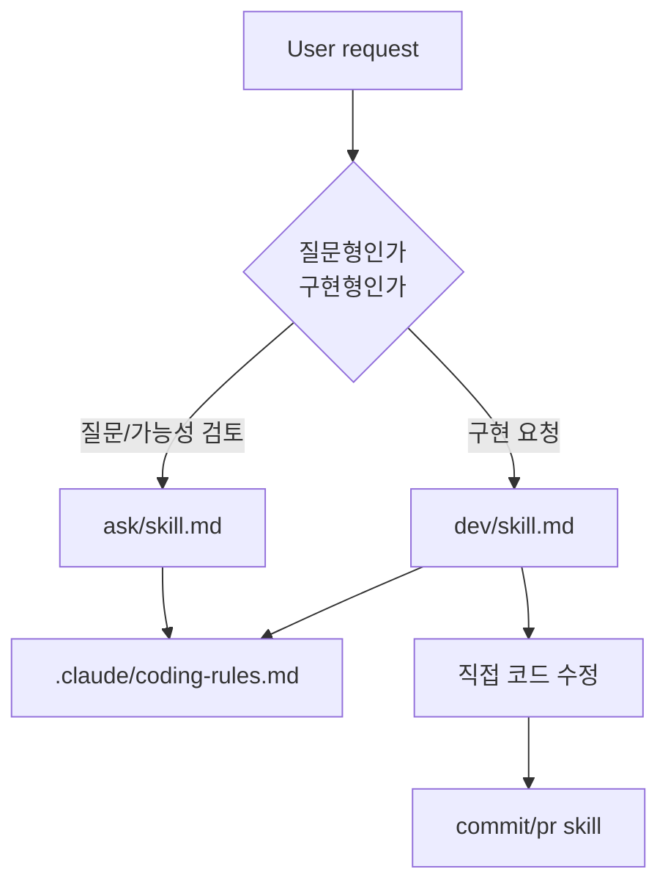

### 규칙과 연결 방식

- 라우팅 규칙은 파일 frontmatter의 `description`과 trigger 문구에 사실상 의존했다.
- 구현 규칙은 `.md` 문서에 서술형으로 적혀 있었다.
- 테스트는 자동 강제가 아니라 사용자 확인과 스킬 절차에 따라 선택적으로 수행됐다.
- 폴더 구조 규칙과 네이밍 규칙은 "읽고 따르는 문서"였지, 엔진이 강제하는 구조는 아니었다.

### 이 시기의 특징

- 사람에게 설명하는 스킬이 중심이었다.
- 문서가 많아질수록 Claude가 읽어야 할 양도 같이 늘어났다.
- 규칙 위반을 막는 기계적 가드가 약했다.
- 산출물은 주로 "바로 코드 변경"이었다. 계획 아티팩트가 핵심은 아니었다.

---

## Stage 1. 2026-01-11 ~ 2026-02-10
## `.claude` 운영체계 확장 시기

### 핵심 변화

이 시기부터 단순 스킬 모음이 아니라 `.claude/` 자체를 운영체계처럼 다루기 시작했다.

주요 파일:

- `.claude/architecture.md`
- `.claude/planning.md`
- `.claude/agents/*`
- `.claude/commands/*`

### 당시 요청 처리 흐름

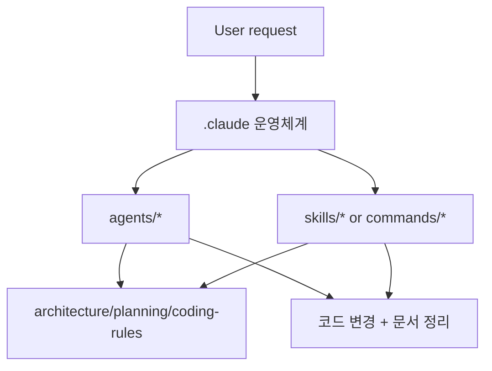

### 규칙과 연결 방식

- 규칙은 여전히 문서 중심이었다.
- 다만 이제 규칙 문서가 분산되기 시작했다.
  - 아키텍처 규칙
  - 계획 규칙
  - 폴더 구조 규칙
  - 에이전트 역할 규칙

### 이 시기의 의미

- "무슨 작업을 하느냐"뿐 아니라 "어떤 역할이 그 작업을 해야 하느냐"가 분리되기 시작했다.
- 이후 skills/agents 구조로 넘어갈 토대가 여기서 생겼다.

---

## Stage 2. 2026-02-11 ~ 2026-02-17
## skills + agents + docs 중심 시기

### 핵심 변화

이 시기에는 `skills-based architecture`가 본격 도입된다.

대표 문서:

- `.claude/CLAUDE.md`
- `.claude/skills/frontend-dev/SKILL.md`
- `.claude/skills/backend-dev/SKILL.md`
- `.claude/skills/ui-publish/SKILL.md`
- `.codex/skills/plan-maker/SKILL.md`

### 요청이 들어왔을 때의 전체 플로우

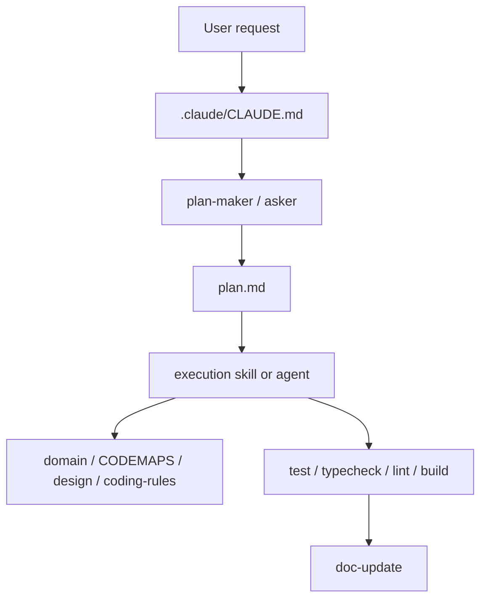

### 이 시기 `frontend-dev`가 실제로 따른 문서

당시 `frontend-dev`는 대략 아래 순서로 움직였다.

1. `plan.md` 읽기
2. `domain.md` 읽기
3. `CODEMAPS/frontend.md` 읽기
4. `design/` 읽기
5. 필요 시 docs 검색
6. feature branch 생성
7. 구현
8. `pnpm test`
9. `typecheck`
10. `lint --fix`
11. `build`

즉 이때는 계획은 생겼지만, 실제 코드 생성은 아직 문서와 사람이 기억하는 규칙에 크게 의존했다.

### 규칙과 연결 방식

- 라우팅 규칙: `.claude/CLAUDE.md`
- 실행 규칙: 각 `SKILL.md`
- 도메인/구조 규칙: `.ai/references/*`, `.ai/codemaps/*`, `.ai/references/design/*`
- 검증 규칙: 테스트, 타입체크, 린트, 빌드

### 이 시기의 한계

- 문서 참조량이 많아 토큰 비용이 커졌다.
- 규칙이 서술형이라 같은 요청에도 생성 패턴이 흔들릴 수 있었다.
- plan과 docs는 좋아졌지만 scaffold 강제력이 약했다.
- 스킬이 전문화되기 시작했지만, 각 스킬이 독립적으로 닫힌 시스템은 아니었다.
  - 예: `frontend-dev`는 당시 `coding-rules`, `design`, `CODEMAPS`, `domain`, `plan`을 모두 읽는 구조였다.
  - 즉 스킬이 실행되기 전에 읽어야 하는 공통 문서 묶음이 컸다.

---

## Stage 3. 2026-02-18 ~ 2026-02-23
## v2.x worktree 필수 + 8-phase 운영 시기

### 핵심 변화

`v2.0.0` 전후로 worktree가 사실상 필수 계약이 된다.

대표 문서:

- `.claude/CLAUDE.md`
- worktree 관련 정책 문서
- plan-maker / planner 계열 문서

### 요청 처리 흐름

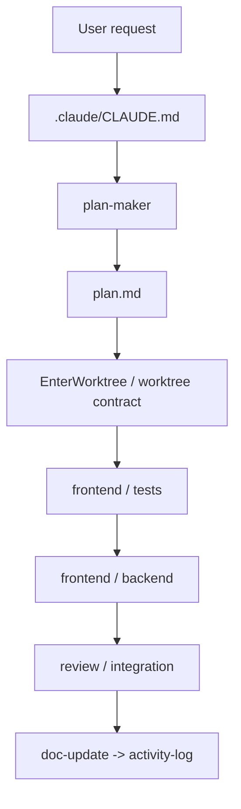

### 이 시기부터 달라진 점

- 코드 변경은 메인 브랜치 직행이 아니라 worktree 격리 공간에서 수행됐다.
- 요청 하나가 phase 단위로 분해되기 시작했다.
- "문서를 읽고 구현"에서 "계획을 세우고 phase를 밟는 운영"으로 중심축이 이동했다.

### 규칙과 연결 방식

- 작업 순서 규칙: `CLAUDE.md`
- 격리 규칙: worktree 정책
- 역할 분담 규칙: `agents/*`
- 산출물 순서 규칙: `doc-update`와 `activity-log` tail order

### 의미

이 시기부터 Claude Code는 개인 비서형에서 워크플로 엔진형으로 변했다.

---

## Stage 4. 2026-02-24 ~ 2026-03-02
## v3.x artifact-first Claude/Codex 통합 시기

### 핵심 변화

이때 `.ai/` 폴더가 공식 계약 경로로 정착한다.

대표 문서:

- `.claude/CLAUDE.md`
- `.codex/skills/plan-maker/SKILL.md`
- `.codex/skills/brainstorm/SKILL.md`
- `.ai/plans/*`
- `.ai/requirements/*`

### 요청 처리 흐름

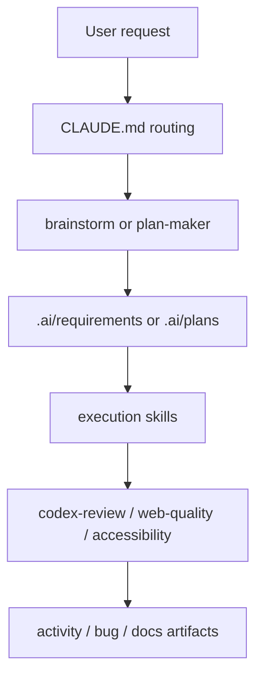

### 이 시기의 특징

- 문서가 더 많아졌지만 구조는 더 명확해졌다.
- 요청 처리의 중심이 대화가 아니라 아티팩트 파일이 됐다.
- Codex planning skill과 Claude execution skill의 역할 분리가 선명해졌다.

### 규칙과 연결 방식

- 계획 규칙: `plan-maker`
- 요구사항 정리 규칙: `brainstorm`
- 실행 규칙: `.claude/skills/*`
- 운영 산출물 규칙: `.ai/*` 폴더 계약

### 이 시기 한계

- 문서 계약은 강해졌지만, 코드 생성 규칙은 아직 문서 설명 비중이 컸다.
- 실행 품질이 "규칙을 얼마나 잘 기억하느냐"에 영향을 받았다.

---

## Stage 5. 2026-03-03 ~ 2026-03-05
## v4.x planner-lite + skill dispatch + Jira 정리 시기

### 핵심 변화

대표 기능:

- `planner-lite`
- `init-agent`
- `jira`
- `skill` 기반 dispatch

### 요청 처리 흐름

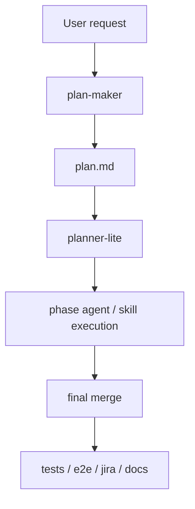

### 여기서 생긴 중요한 정리

- plan 실행을 누가 소유하느냐가 `planner-lite`로 정리됐다.
- worktree lifecycle도 점점 문서가 아니라 실행 절차로 구조화됐다.
- `jira-md-review-registration`이 `jira`로 정리되면서 프로젝트 연동 스킬도 단순화됐다.

### 규칙과 연결 방식

- `plan-maker`는 계획 생성
- `planner-lite`는 계획 실행 orchestration
- 각 실행 스킬은 자기 영역의 구현 수행
- `Jira`는 산출물 검증 후 외부 시스템 등록

이 구간은 기존 단일 레포 아키텍처의 거의 완성형이다.

---

## Stage 6. 2026-03-06
## pluginization 전환 시기

### 핵심 변화

이날부터 `claude-code-skills`의 운영체계를 **배포 가능한 플러그인**으로 분리하려는 전환이 시작된다.

관련 문서:

- `try-claude-plugin/` 구조 설명
- plugin identity / runtime contract / migration map 관련 계약 문서
- `init-try` / migration 엔진 관련 문서

### 전환 도식

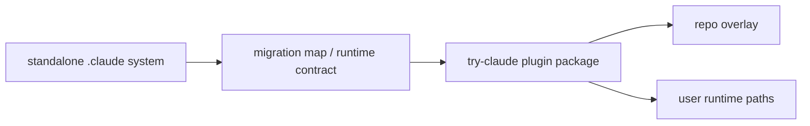

### 이 시기의 핵심 의미

- 기존에는 레포 안에 `.claude`를 두고 운영했다.
- 이제는 배포 가능한 플러그인 루트가 생기고, 프로젝트별 overlay와 사용자 runtime 경로가 분리된다.
- 즉 "내 레포 내부 운영 체계"에서 "설치 가능한 제품"으로 성격이 바뀐다.

---

## Stage 7. 2026-03-06 ~ 2026-03-31
## `try-claude-code`의 plugin + dev-cli 실험 시기

이 시기는 `claude-code-skills` 운영체계를 installable plugin으로 떼어내고, scaffold 규칙을 별도 runtime으로 강제해 보던 과도기였다.

핵심 변화는 두 가지였다.

- marketplace, plugin packaging, eval 정비
- `frontend` / `backend` / `dev-cli` 조합으로 생성 규칙을 manifest recipe에 고정

### 당시 구조의 최상위 지도

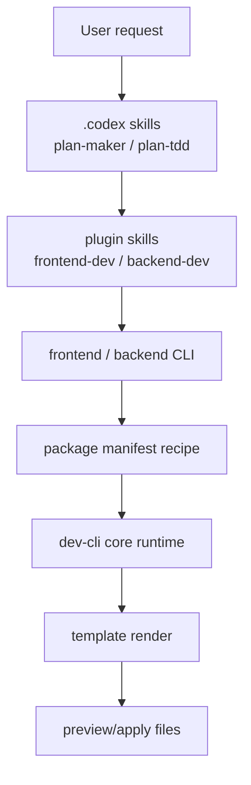

### 이 시기의 의미

- 문서에 적어 두던 생성 규칙을 runtime recipe로 이관했다.
- `preview/apply`와 validator를 통해 scaffold 재현성을 높이려 했다.
- planning skill과 execution skill이 분리되었지만, 구현 중심 surface는 아직 scaffold 엔진이 강하게 쥐고 있었다.

### 이 시기가 오래 가지 않은 이유

`2026-04-01`에 `packages/`와 dev CLI scaffold가 제거된다. 즉 Stage 7은 "현재 구조"가 아니라, 문서 규칙을 runtime recipe로 밀어 넣어 보던 짧은 실험 단계로 읽는 편이 맞다.

---

## Stage 8. 2026-04-01 ~ 2026-04-28
## plugin split + artifact-driven planning stack 시기

> **이 단계의 일부 서술은 superseded다.** 아래 본문은 `2026-04-28` 시점 상태를 기록한 것이다. dev-review의 live preview iframe, develop `2.5.0`, `preview-pool.mjs`, `session-restore` 같은 항목은 `2026-05` 이후 제거·재설계됐다. Stage 9가 그 후속 historical snapshot이고, 현재 구조는 **Stage 10**과 [`docs/current-architecture.md`](../../docs/current-architecture.md)를 참조한다.

`2026-04-01` 이후에는 구조가 다시 크게 바뀐다.

- `frontend-dev`, `backend-dev`에서 CLI scaffold 의존을 제거하고 convention discovery로 전환
- `claude-plugin/develop`와 `claude-plugin/statusline`으로 서브플러그인 분리
- session lifecycle, worktree-aware stop gate, session restore 같은 runtime hook 계층 강화
- `.codex/skills/*`를 로컬 planning stack으로 정리
- plan wiki staging, 이후 link-only planning root로 고정
- orchestrator를 stateless, artifact-driven 흐름으로 재구성
- planning docs gate, feedback triage, QA verification, visual parity 스킬 분리 추가
- 구현 완료 후 merge 전 단계에 `claude-plugin/develop/skills/dev-review` 기반 implementation review gate 추가
- `dev-review`는 plugin-internal multi-review server, data-only task artifacts, commit별 live preview iframe, route override를 갖는 구조로 발전 *(live preview iframe과 route override는 `2026-04-28~29`에 제거됨 — Stage 9 참조)*
- 메인 develop 플러그인은 이 흐름을 포함해 `2.5.0`으로 갱신 *(현재는 `2.17.0`)*

### 현재 구조의 최상위 지도

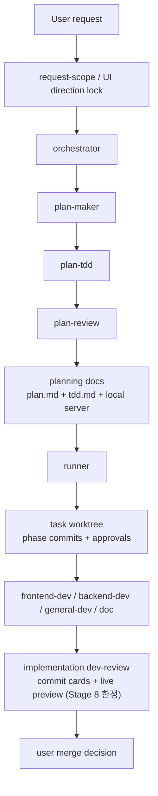

### 현재 요청 처리의 실제 단계

예시: "대시보드 알림 필터 로직을 추가해줘"

1. 요청이 모호하면 request-scope나 UI direction 선결정을 먼저 잠근다.
2. `orchestrator`가 `plan-maker`를 호출해 `plans/{task}/plan.md`와 phase detail 아티팩트를 만든다.
3. `plan-tdd`가 계획 행/시나리오를 실제 테스트와 manual smoke 항목으로 옮긴다.
4. `plan-review`가 현재 `plan.md`와 `tdd.md`를 함께 cold review한다.
5. `orchestrator`가 planning docs 패키지를 만들고, `.codex/tools/planning-docs-browser-server.mjs`로 로컬 review UI를 서빙한다.
6. `runner`가 task별 worktree를 만들고 phase별 agent를 순차 실행한다.
7. `frontend-dev`나 `backend-dev`는 더 이상 CLI scaffold를 호출하지 않고, 기존 코드에서 convention을 발견한 뒤 구현한다.
8. 모든 phase commit 뒤 `runner`가 `dev-review`를 호출해 commit card, diff, live preview 기반 구현 리뷰를 연다.
9. reviewer가 `needs-change`를 남기면 선택한 `dispatch_agent` 기준으로 같은 worktree에서 재작업 round가 돈다.
10. 구현 리뷰가 승인되면 runner가 worktree를 정리하고 사용자에게 merge / PR / 나중에 선택지를 묻는다. 머지를 선택하면 plan 디렉터리에 `.merged` 마커가 생기고 같은 plan에 대한 재진입은 그 마커로 차단된다.

### 구현 리뷰 단계 (Stage 8 시점)

> 아래 표·서술은 `2026-04-28` 상태다. dev-review는 그 직후 GitHub-style 라인 코멘트 + multi-round로 재설계되며 live preview iframe은 제거됐다. 현재 dev-review 구조는 Stage 9를 본다.

Stage 8의 중요한 추가점은 planning review와 implementation review가 분리됐다는 점이다.

| 구분 | Planning review | Implementation review |
|---|---|---|
| 소유자 | `.codex/skills/orchestrator` | `claude-plugin/develop/skills/dev-review` |
| 검토 대상 | `plan.md`와 phase detail | runner가 만든 실제 commit, diff, test, merge impact |
| 서버 | `.codex/tools/planning-docs-browser-server.mjs` | `claude-plugin/develop/skills/dev-review/scripts/server.mjs` |
| URL 성격 | planning docs package | `http://localhost:9797/review/{task_slug}` multi-review |
| 아티팩트 | `plans/*/planning-docs/*` | `plans/*/dev-review/review-data.json`, `feedback.json`, `review-history.json`, `assets/diffs/*` |

`dev-review`는 task별 폴더에 HTML을 복사하지 않는다. task 폴더는 data-only로 유지하고, UI shell과 vendor asset은 plugin 내부 copy를 직접 서빙한다. 그래서 UI 버그 수정이 기존 review data에도 즉시 적용되고, review artifact diff가 불필요하게 커지지 않는다.

commit step에서는 오른쪽 sticky panel에 live preview iframe이 붙는다. browser가 `GET /review/{slug}/api/preview/status`를 처음 polling할 때 dev-review server가 worktree의 package를 탐지하고, `scripts.dev`가 있으면 free port에 dev server를 lazy spawn한다. reviewer가 commit별 route input을 바꾸면 `feedback.json.preview_routes[short_sha]`에 저장되어 같은 round에서 유지된다.

### 현재 구조에서 문서와 코드의 역할 분리

| 계층 | 역할 | 대표 파일 |
|---|---|---|
| 배포 메타 | 로컬 plugin bundle 공개 | `.claude-plugin/marketplace.json`, `.agents/plugins/marketplace.json` |
| planning 계층 | 요청 잠금, 계획 생성, cold review, TDD contract test 작성, plan wiki 연동 | `.codex/skills/brainstorm/SKILL.md`, `.codex/skills/plan-maker/SKILL.md`, `.codex/skills/orchestrator/SKILL.md`, `.codex/skills/plan-review/SKILL.md`, `.codex/skills/plan-tdd/SKILL.md` |
| 실행 계층 | worktree 기반 구현/문서화/검증 실행 | `claude-plugin/develop/skills/runner/SKILL.md`, `claude-plugin/develop/skills/frontend-dev/SKILL.md`, `claude-plugin/develop/skills/backend-dev/SKILL.md`, `claude-plugin/develop/skills/general-dev/SKILL.md` |
| 구현 리뷰 계층 | commit 기반 구현 리뷰, feedback routing, live preview | `claude-plugin/develop/skills/dev-review/SKILL.md`, `claude-plugin/develop/skills/dev-review/scripts/server.mjs`, ~~`scripts/lib/preview-pool.mjs`~~ *(제거됨; 현재 lib 구성은 Stage 9 참조)* |
| 역할 프롬프트 | 도메인별 agent 책임 정의 | `claude-plugin/develop/agents/frontend-developer.md`, `claude-plugin/develop/agents/backend-developer.md`, `claude-plugin/develop/agents/general-developer.md` |
| runtime hook 계층 | 세션 추적, /runner 부트스트랩 | `claude-plugin/develop/hooks/hooks.json`, `claude-plugin/develop/scripts/session-lifecycle-hook.mjs`, `claude-plugin/develop/scripts/user-prompt-submit-hook.mjs` *(Stage 9에서 session-lifecycle hook은 제거되고 `UserPromptSubmit` → `user-prompt-submit-hook.mjs` 하나만 남음)* |
| planning review / knowledge 계층 | planning docs UI와 plan wiki 관리 | `.codex/tools/planning-docs-browser-server.mjs`, `.codex/tools/plan-wiki-docs-server.mjs`, `.codex/skills/plan-wiki-setup/SKILL.md`, `.codex/skills/plan-wiki-ingest/SKILL.md`, `.codex/skills/plan-wiki-lint/SKILL.md`, `.codex/skills/plan-wiki-apply-feedback/SKILL.md` |
| statusline 계층 | 상태줄 bootstrap / sync / mode 전환 | `claude-plugin/statusline/skills/statusline/SKILL.md`, `claude-plugin/statusline/hooks/hooks.json` |

### 현재 구조의 가장 큰 차이

Stage 7까지는 "규칙을 실행 가능한 recipe로 옮기는 것"이 핵심이었다.

현재 구조는 거기서 한 번 더 이동했다.

- 워크플로 규칙은 여전히 `SKILL.md`에 있다.
- 하지만 구현 규칙은 더 이상 별도 scaffold CLI가 아니라, **기존 코드베이스 convention + plan artifact**에서 읽어 온다.
- 실행 강제는 CLI runtime이 아니라 **worktree, hook, implementation dev-review artifact**가 맡는다. (자동 stop-review gate는 dev-review와 중복이라 제거됐다 — `2026-05` 정리.)
- 공통 지식은 큰 coding-rules 문서 대신 **plan wiki + plan/review artifact**에 축적된다.

즉 Stage 8까지는 "설명 문서 -> recipe engine"에서 멈추지 않고, "artifact + runtime guard + convention discovery" 구조로 다시 재편된 상태다.

---

## Stage 9. 2026-05-01 ~ 2026-06-29 (historical snapshot)
## dev-review 재설계 + 인터페이스 축소 + dev-wiki 지식 스택

Stage 8 직후부터 두 갈래로 정리가 진행됐다. (1) 만들었다 무거워진 부분을 도로 줄이는 정리, (2) 새 지식 계층(dev-wiki) 추가.

### 1. dev-review 재설계 — live preview 제거, GitHub-style 라인 코멘트로 전환

`2026-04-28`에 추가됐던 live preview iframe / per-commit route override / `preview-pool.mjs` 기반 dev server lazy spawn은 **하루 만에(`2026-04-28~29`) 다시 제거**됐다. 대신 dev-review UI는 GitHub PR을 더 직접 모사하는 형태로 재설계됐다(schema v2).

- commit 사이드바 + Files Changed 패널 + **라인 앵커 코멘트**(`needs-change` / `question` / `out-of-scope`)
- `needs-change`에는 `dispatch_agent`를 선택해 같은 worktree에서 재작업 round를 돌린다.
- **multi-round review with history**: round가 끝나면 해결된 코멘트는 `review-history.json`으로 아카이브되고 live `feedback.json`에서 제거된다. round 라벨은 `current_round` 카운터 대신 `task_head_sha`로 매긴다.

현재 dev-review의 실제 파일 구성:

| 구분 | 파일 |
|---|---|
| 진입 | `claude-plugin/develop/skills/dev-review/SKILL.md` (v2, model: sonnet) |
| 서버 | `scripts/server.mjs` (discovery 기반) |
| 데이터 생성 | `scripts/generate-review-data.mjs` |
| lib | `scripts/lib/{agents,args,comment-types,git,output,plan}.mjs` |
| UI | `assets/index.html` (+ `assets/vendor/diff2html-ui.min.js`, `highlight.min.js`) |
| references | `references/{helper-contract,review-data-schema,ui-contract}.md` |

### 2. caller 인터페이스 축소 — `state_path` 단일 SSOT

dev-review는 더 이상 `task_slug` / `plan_path` / `worktree_path` / `base_branch` / `task_branch`를 개별 flag로 받지 않는다. 호출자는 **`plans/{plan_key}/.runner-state.json` 경로 하나만** 넘기고, 나머지 identity는 runner-state 라이브러리로 디스크에서 읽는다. caller와 skill이 identity를 협상하지 않고 디스크에 단일 진실을 둔다.

runner 쪽도 함께 정리됐다.

- runner를 plan-level dispatch로 전환(`2026-05-04`)
- folder-style `plan.md`(폴더당 `plan.md`)도 허용(`2026-05-11`)
- 경로는 `plan_key`로 일관되게 지칭
- 자동 stop-review gate, Codex broker daemon, 3-strike escalation, `consecutive_downgrades` 등 중복/과설계 게이트 제거

### 3. runtime hook 축소

세션 lifecycle hook 계층(`session-lifecycle-hook.mjs`, `session-restore` 스킬)은 제거됐다. 현재 `claude-plugin/develop/hooks/hooks.json`에는 `UserPromptSubmit` 하나만 남아 `/runner` path-sanity gate(`user-prompt-submit-hook.mjs`)를 건다.

### 4. dev-wiki 지식 계층 도입 (`2026-05-29 ~`)

Stage 8까지 "공통 지식은 plan wiki + plan/review artifact에 축적"이라고 적었는데, `2026-05` 말부터 **프로젝트별 dev wiki**라는 별도 지식 계층이 추가됐다. `.codex/dev-wiki/`(config.json + source 클론)를 루트로 두고 3개 스킬이 관리한다.

| 스킬 | 역할 |
|---|---|
| `dev-wiki-setup` | private `SeoJaeWan/dev-wiki` 레포의 프로젝트-local 클론 생성/검증/동기화, Obsidian vault 기본값 + 프로젝트 폴더 부트스트랩 |
| `dev-wiki-update` | 사용자 제공 프로젝트 규칙·컨벤션·폴더 구조·아키텍처 노트를 dev wiki에 기록/동기화 |
| `dev-wiki-graph` | 레포 facts(폴더/파일/import/export/symbol/test/route/script/deps/config/asset/env/external boundary)에서 프로젝트 그래프 생성·갱신 |

`dev-wiki-graph`는 `scripts/lib/{scan,graph-core,code-index,prose-index}.mjs`로 모듈화돼 있고, v2 indexing → facts-first graph로 두 차례 재작성됐다(`9a0600a`, `c320dda`, `972ea34`). 현재 활발히 변경 중인 영역이다.

### Stage 9 한 줄 요약

Stage 8이 "구현 리뷰 + live preview까지 붙여 기능을 넓힌" 단계였다면, Stage 9는 **(a) 넓혔던 dev-review를 GitHub-style로 다시 좁히고 인터페이스를 `state_path` 하나로 축소하고, (b) plan wiki와 별개로 프로젝트 dev-wiki 지식 계층을 새로 세운** 단계다.

---

## Stage 10. 2026-06-30 ~ 현재
## Codex Workbench를 메인 사용자-facing 플러그인으로 정리

2026-06-30의 `fe581c0`에서 Claude와 Codex 플러그인을 별도 영역으로 나눈 뒤, 현재의 작업 진입점은 `codex-plugin/plugins/workbench/`로 수렴했다. Stage 8–9에 기록된 `claude-plugin/develop` 중심의 "현재 흐름"은 역사적 실행 레이어 설명으로 읽어야 하며, Codex 작업 도구의 최신 기준은 [`docs/current-architecture.md`](../../docs/current-architecture.md)다.

### 전환을 만든 커밋 흐름

- `fe581c0` — Claude Code 플러그인을 `claude-plugin/`으로 분리하고 Codex 플러그인 영역을 별도로 시작
- `4770e39` — 이전 `.codex` legacy skill bundle 제거
- `9c383c6` — `codex-plugin/plugins/workbench/`에 issue brief, dev wiki, brainstorm, test brief 기반 Workbench workflow 추가
- `cb9aedc`, `63bc3aa`, `a113713` — 범위가드 실행, OpenAPI registry, endpoint testing 확장
- `71bfaec`, `52618b4` — commit 기반 branch report와 visual grounding 추가
- `030d2bc` 이후 — 명시적 Fable5 operating mode와 Workbench 문서 계약 보강
- `e709108`, `9d3cbd7` — brainstorm/executor가 Issue Brief Work Unit handoff를 보존하도록 계약 강화

### 현재 Codex Workbench 흐름

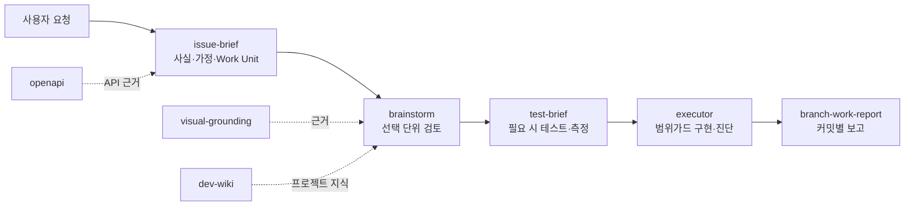

Workbench는 Codex의 메인 사용자-facing 스킬을 소유한다. `.codex/`는 project-local planning/wiki 상태와 도구를 소유하며, `claude-plugin/`은 별도 Claude Code 실행·상태줄 플러그인으로 남는다.

---

## 문서 부담과 스킬 독립성의 변화 (Stage 0–9 historical analysis)

이 흐름은 단순히 "버전이 올라갈수록 구조가 복잡해졌다"로 읽으면 오해가 생긴다.

실제로는 아래 4가지가 차례로 일어났다.

1. 초기에 컸던 공통 문서 의존성이 줄었다.
2. 스킬 간 책임 경계가 더 날카로워졌다.
3. Stage 7에서는 반복 규칙 일부를 manifest/runtime으로 옮겼다.
4. 현재는 그 scaffold runtime을 제거한 뒤에도 working set을 작게 유지하도록 artifact와 hook 계약을 재배치했다.

### 먼저 결론

전체 플로우를 시간축으로 보면 **초기에는 Claude가 읽어야 할 공통 문서가 많았고**, 중간에는 그 문서를 progressive disclosure 방식으로 잘게 나눴고, **Stage 7에서는 반복 생성 규칙을 CLI runtime으로 옮겼다가**, **현재는 계획/리뷰 아티팩트와 코드베이스 convention discovery로 다시 균형을 잡았다**.

중요한 점은 "파일 개수"와 "실제로 한 번의 작업에서 읽는 문맥량"이 항상 같이 움직이지는 않는다는 것이다.

- 어떤 시기에는 토큰 효율을 위해 문서를 더 잘게 쪼개서 **파일 수는 늘었지만**
- 실제 스킬이 한 번에 읽는 **working set은 줄었다**
- 현재는 skill 수가 다시 늘어도, 각 스킬이 읽는 책임 범위는 더 좁아질 수 있다

즉 감소한 것은 단순 파일 수가 아니라, **작업당 참조 부담과 중복 설명량**이다.

### 흐름을 바꾼 주요 커밋들

| 날짜 | 커밋 | 의미 |
|---|---|---|
| 2026-02-09 | `082c0e6` | documentation structure를 token efficiency 기준으로 재정렬 |
| 2026-02-13 | `ed40bb6` | `CLAUDE.md`를 per-folder README로 분리해 한 번에 읽는 문맥 축소 |
| 2026-02-19 | `1552e88` | 7개 대형 스킬에 `references/` 분리 적용 |
| 2026-02-24 | `27e7b61` | verify-skills 생태계, settings duplication, workflow position 중복 제거 |
| 2026-03-03 | `cfc8e9d` | plan-maker/worktree가 legacy agent references에 덜 의존하도록 분리 |
| 2026-03-05 | `95f810a` | 대형 인라인 템플릿을 `references/`로 추출해 progressive disclosure 강화 |
| 2026-03-14 | `97af75e`, `5accc71` | `frontend-dev`, `ui-publish`에서 redundant section 제거 |
| 2026-03-15 | `bd6bc9c` | references 통합, design refs 제거, typecheck/lint 문맥 제거 |
| 2026-03-15 | `daaec82` | skill별 coding-rules 참조와 `init-coding-rules` 제거, CLI가 규칙 대체 |
| 2026-04-01 | `b965194`, `b2cf8ad` | convention discovery 전환, `packages/` 제거로 dev CLI 실험 종료 |
| 2026-04-02 | `e245d94` | session lifecycle + worktree-aware stop-gate 도입 |
| 2026-04-10 | `856d24b`, `ac63606` | `claude-plugin/develop`, `claude-plugin/statusline` 분리와 skill 명칭 정리 |
| 2026-04-20 | `2b7e237`, `b44b996` | QA verification 추가, orchestrator의 stateless artifact-driven 정리 |
| 2026-04-22 | `28f8671`, `71ad200` | generic skill subagent 전환, plan wiki link-only 고정 |
| 2026-04-23 | `c81b67b` | planning docs gate 추가 |
| 2026-04-24 | `9d8604e`, `6eadc7c` | review feedback triage와 overview/detail split 도입 |
| 2026-04-24 | `792897c` | runner 완료 후 merge 전 implementation review gate 추가 |
| 2026-04-27 | `0f98597`, `12808df` | plugin-internal dev-review server, multi-session review URL, card id/agent discovery 계약 보강 |
| 2026-04-27 | `56812bd`, `d5d5b54`, `bff83bb` | planning skill reference 분리, Node launcher 전환, `ui-spec` 명칭 정리 |
| 2026-04-28 | `38250e6`, `97db883`, `8b40ae1` | dev-review live preview pool, iframe panel, commit별 route override, lifecycle 문서화 |
| 2026-04-28 | `3b698bf`, `7caea7d` | shell 기반 command spawning 축소, develop plugin `2.5.0` 갱신 |

### 스킬 수 자체도 줄어들었는가

일관되게 줄기만 한 것은 아니다.

- Stage 7에서는 실행 surface를 CLI와 manifest로 압축하려는 경향이 강했다.
- 현재는 planning, review, QA, visual parity, statusline이 다시 분리되면서 skill 수는 늘었다.

하지만 더 중요한 것은 **카탈로그 크기보다 각 스킬이 자기 책임 안에서 더 닫히게 됐다는 점**이다.

### 실제 working set 비교

#### 예시 1. 과거 `frontend-dev`

당시 명시적으로 읽으라고 적혀 있던 항목:

- `coding-rules/`
- `design/`
- `CODEMAPS/frontend.md`
- `domain.md`
- `tailwind.config.js`
- `app/globals.css`
- `components/ui/`
- `plan.md`
- 필요 시 docs-search

즉 구현 전에 **문서 묶음 전체를 먼저 읽는 구조**였다.

#### 예시 2. 현재 `frontend-dev`

현재는 대략 아래만 핵심이다.

- `plans/{task-name}/plan.md`
- `codemaps/frontend.md` (있으면)
- 기존 컴포넌트, hook, page 예시 2~3개
- UI 작업이면 `tailwind.config.*`, `app/globals.css`, 토큰 파일
- Figma URL이 있으면 Figma MCP에서 읽은 design context

중요한 차이:

- `coding-rules.md`를 직접 읽어 규칙을 기억하지 않는다.
- `design/` 전체를 먼저 읽는 것이 기본 흐름이 아니다.
- 프로젝트 convention은 별도 scaffold profile이 아니라 **현재 코드베이스에서 발견**한다.

즉 **참조 대상이 거대한 공통 문서에서 plan artifact와 repo-local examples 쪽으로 이동**했다.

### backend-dev도 같은 흐름인가

그렇다.

과거 `backend-dev`는 아래를 항상 읽도록 되어 있었다.

- `naming.md`
- `folder-structure.md`
- `code-style.md`
- `typescript.md`
- `package-manager.md`
- `CODEMAPS/backend.md`
- `CODEMAPS/database.md`
- `domain.md`
- `plan.md`

현재 `backend-dev`는 아래 흐름으로 축소됐다.

- `plan.md`
- `codemaps/backend.md`, `codemaps/database.md` (있으면)
- 기존 controller / service / repository / DTO 예시 2~3개
- build 파일과 테스트 패턴
- 에러 응답, validation, DI 관례를 보여 주는 현재 소스

즉 DB snake_case, package structure, DTO naming 같은 규칙을 문서에서 외우는 대신 **현재 코드베이스와 plan artifact에서 직접 발견**한다.

### 중복 문서가 줄어든 방식

중복 감소는 세 단계로 일어났다.

#### 1. 문서 분할을 통한 중복 축소

처음에는 큰 문서 하나에 많은 내용을 넣는 방식이었다.

- 장점: 파일 수가 적다.
- 단점: 한 번의 작업에서 불필요한 내용까지 같이 읽게 된다.

그래서 중간에는 `references/` 분리와 per-folder README 전략이 들어갔다.

- 장점: 필요한 부분만 읽는다.
- 단점: 파일 수는 잠시 늘어날 수 있다.

#### 2. Stage 7의 runtime recipe 이관

문서 분리만으로 부족한 부분은 manifest/runtime으로 옮겼다.

대표 사례:

- output file pattern
- validator rule
- template render context
- scaffold command surface

이 단계에서는 반복 생성 규칙을 별도 runtime이 소유했다.

#### 3. 현재의 artifact + convention discovery 재배치

`2026-04-01` 이후에는 dev CLI가 제거되지만, 다시 옛날처럼 큰 문서를 읽는 구조로 돌아가지는 않았다.

대신 공통 규칙이 아래로 분산된다.

- planning 판단: `.codex/skills/*` + `plans/*` artifacts
- review 지식: plan wiki
- 구현 convention: repo-local examples
- 실행 가드: `runner`, hooks, dev-review (사람 게이트)

그래서 지금도 문서 중복은 줄어든다.

- 스킬마다 같은 coding-rules 설명을 길게 반복하지 않아도 된다.
- 거대한 공통 문서를 항상 먼저 읽지 않아도 된다.
- skill 본문은 workflow와 boundary를 설명하고, 실제 코드 규칙은 현행 코드베이스가 소유한다.

### 이 흐름을 한 줄로 도식화하면

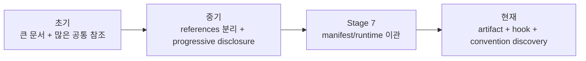

### 전체 플로우에서 왜 이게 잘 안 느껴졌는가

이전 버전의 타임라인은 "무슨 phase를 거치느냐" 중심이라서,

- 한 요청당 몇 개 문서를 읽어야 했는지
- 스킬이 얼마나 독립적으로 닫혀 있었는지
- 중복 설명이 실제로 어디서 제거됐는지

가 상대적으로 덜 보였다.

그래서 이 문서를 읽을 때는 아래 관점도 같이 봐야 한다.

| 관점 | 초기 | 중기 | 현재 |
|---|---|---|---|
| 라우팅 | trigger 문구 중심 | CLAUDE + plan-maker 중심 | planning skill + plugin skill + review gate |
| 규칙 저장 위치 | markdown 문서 | markdown + references + plan contract | `SKILL.md` + plan/review artifacts + repo-local conventions + hook/runtime scripts |
| 스킬 독립성 | 낮음 | 중간 | 높음 |
| 공통 문서 참조량 | 많음 | 분리되지만 여전히 큼 | 크게 줄어듦 |
| 중복 설명 | 많음 | 분리/이관 중 | artifact와 역할별 skill로 재배치 |

---

## 같은 요청을 시대별로 비교

예시 요청: `알림 필터 기능 추가해줘`

### 1. 2025-12 방식


특징:

- 빠르지만 재현성은 낮다.
- 규칙 위반이 발생해도 막는 엔진이 없다.

### 2. 2026-02 v2/v3 방식


특징:

- 운영 절차는 강해졌지만 생성 패턴은 아직 문서 기억에 의존한다.

### 3. 2026-04 현재 방식


특징:

- 계획, TDD, review, 구현, dev-review가 artifact로 연결된다.
- 생성기보다 plan artifact와 repo-local convention이 더 중요하다.
- 구현 결과도 commit 단위 dev-review와 live preview를 거쳐 merge decision으로 넘어간다.
- 같은 종류의 요청을 반복할수록 결과가 더 안정적이다.

---

## 규칙 소유권의 진화

### 1. 초기

```text
규칙 = markdown 문서
실행 = Claude가 읽고 따라 함
```

### 2. 중간

```text
규칙 = markdown 문서 + plan artifacts + workflow contract
실행 = 에이전트/스킬이 phase 순서에 따라 수행
```

### 3. Stage 9까지의 현재 스냅샷 (역사 기록)

```text
워크플로 규칙 = SKILL.md
계획/리뷰 규칙 = .codex/skills/* + plans/* artifacts
구현 규칙 = 기존 코드베이스 convention
실행 가드 = hooks + runner + dev-review (사람 게이트)
배포 규칙 = .claude-plugin/marketplace.json + sub-plugin metadata
```

---

## Stage 9 시점 작업 연결 지도 (역사 기록)

| 작업 종류 | 진입점 | 실행 스킬/도구 | 규칙 소스 | 대표 산출물 |
|---|---|---|---|---|
| 요청 잠금 / 기획 | `brainstorm`, `ui-spec`, `plan-maker` | `.codex/skills/*` | plan wiki + planning references | `plans/*`, phase detail, 결정 기록 |
| cold review / planning docs | `plan-review`, `orchestrator`, `planning-docs-browser-server` | `.codex/skills/plan-review/SKILL.md`, `.codex/skills/orchestrator/SKILL.md`, `.codex/tools/planning-docs-browser-server.mjs` | review policy + browser feedback + plan signature | `plans/_orchestrator/review/*`, `plans/*/planning-docs/*` |
| 프론트엔드 구현 | `runner` 후 `frontend-dev` | `claude-plugin/develop/skills/frontend-dev/SKILL.md`, `claude-plugin/develop/agents/frontend-developer.md` | `plan.md` + 기존 UI code conventions | 실제 소스 변경, 필요 시 test/E2E 복사 |
| 백엔드 구현 | `runner` 후 `backend-dev` | `claude-plugin/develop/skills/backend-dev/SKILL.md`, `claude-plugin/develop/agents/backend-developer.md` | `plan.md` + 기존 backend/database conventions | 실제 소스 변경, 필요 시 test/E2E 복사 |
| infra / general | `runner` 후 `general-dev` | `claude-plugin/develop/skills/general-dev/SKILL.md` | `plan.md` + infra config examples | CI/CD, Docker, env, deploy 변경 |
| implementation review | `runner` Step 4 후 `dev-review` | `claude-plugin/develop/skills/dev-review/SKILL.md`, `claude-plugin/develop/skills/dev-review/scripts/server.mjs`, `claude-plugin/develop/skills/dev-review/scripts/generate-review-data.mjs` | commit log + diff + plan signature + reviewer feedback + optional live preview | `plans/*/dev-review/review-data.json`, `feedback.json`, `review-history.json`, raw diffs |
| 세션 / runtime 보조 | `/runner` path-sanity gate, statusline | `claude-plugin/develop/hooks/hooks.json`, `claude-plugin/develop/scripts/user-prompt-submit-hook.mjs`, `claude-plugin/statusline/skills/statusline/SKILL.md` | hook contract + local runtime state | path-gated runner 진입, statusline sync *(session-restore 스킬·session-lifecycle hook은 Stage 9에서 제거됨)* |
| dev wiki 지식 | 프로젝트 규칙/그래프 관리 | `.codex/skills/dev-wiki-setup/SKILL.md`, `.codex/skills/dev-wiki-update/SKILL.md`, `.codex/skills/dev-wiki-graph/SKILL.md`, `.codex/dev-wiki/config.json` | repo facts + 사용자 제공 규칙 | `.codex/dev-wiki/source/*`, 프로젝트 그래프 |

---

## 최종 해석

이 두 레포의 전체 흐름은 아래 문장으로 요약할 수 있다.

> 처음에는 "Claude가 문서를 읽고 규칙을 기억해 개발하는 방식"이었고, 중간에는 "plugin + dev CLI가 scaffold 규칙을 강제하는 방식"을 잠깐 거쳤으며, 현재는 "Codex Workbench가 Work Unit·근거·범위가드를 중심으로 작업을 조율하고, 별도 Claude 플러그인이 실행 레이어를 보조하는 방식"으로 분리됐다.

좀 더 구체적으로 보면 다음과 같다.

1. `claude-code-skills` 초기는 사람 친화적 운영 문서와 대화형 스킬이 중심이었다.
2. 중간에는 `.claude`, `.ai`, `.codex`가 결합된 artifact-first workflow로 발전했다.
3. `try-claude-code` 초기에는 plugin packaging과 dev CLI 기반 scaffold 실험이 들어갔다.
4. 현재는 그 실험을 정리한 뒤, `codex-plugin` Workbench + project-local planning/wiki + 별도 Claude 실행 플러그인 구조로 재편됐다.

즉, 진화 방향은 항상 같다.

- 더 많은 문서가 아니라 더 명확한 책임 분리
- 더 긴 설명이 아니라 더 강한 실행 강제
- 더 많은 수동 기억이 아니라 더 많은 구조화된 artifact와 runtime guard

---

## 참고 파일 목록

### 역사 흐름 확인용

- `claude-code-skills/.claude/CLAUDE.md`
- `claude-code-skills/.claude/CHANGELOG.md`
- `claude-code-skills/.claude/VERSION`
- `claude-code-skills/.claude/skills/frontend-dev/SKILL.md`
- `claude-code-skills/.codex/skills/plan-maker/SKILL.md`
- `docs/dev-cli-design.md`

### 현재 구조 확인용

- [`docs/current-architecture.md`](../../docs/current-architecture.md) — 현재 구조와 책임 경계의 canonical 문서
- `codex-plugin/plugins/workbench/.codex-plugin/plugin.json` — Codex Workbench manifest, capabilities, default prompt
- `codex-plugin/.agents/plugins/marketplace.json` — Codex Workbench marketplace 등록
- `codex-plugin/plugins/workbench/skills/{issue-brief,brainstorm,test-brief,executor}/SKILL.md` — 기본 Work Unit 흐름
- `codex-plugin/plugins/workbench/skills/{branch-work-report,visual-grounding,openapi,dev-wiki,fable5}/SKILL.md` — 보고, 근거 수집, 지식 유지, 선택적 운영 모드
- `codex-plugin/scripts/deploy-workbench-plugin.mjs` — Workbench 배포 스크립트
- `.codex/dev-wiki/config.json`, `.codex/plan-wiki/config.json` — project-local 지식 영역 설정
- `claude-plugin/develop/.claude-plugin/plugin.json` — 별도 Claude Code 실행 플러그인 (`2.20.1`)
- `claude-plugin/statusline/.claude-plugin/plugin.json` — 별도 Claude Code 상태줄 플러그인 (`1.2.0`)
